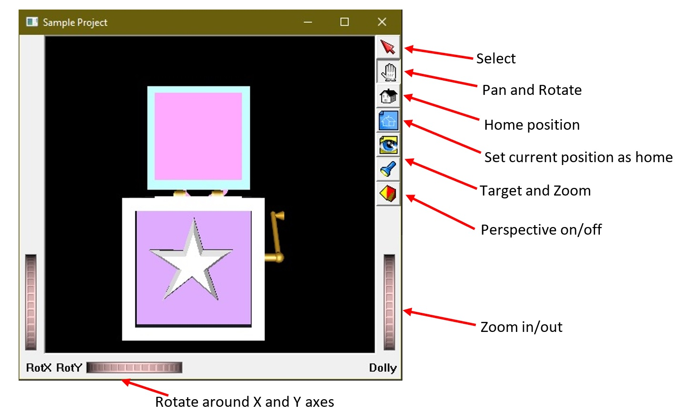

# inventor-utils   
Files and Utilities for working with OpenInventor using the Coin3D library, which is an easy-to-use OpenGL-based graphics library.

This repository includes some files and directories on installing and using Coin3D, which is am easy-to-use library for OpenInventor.

Furthermore, some additional material is included as tutorial for working with the OpenInventor.

Also, a scene viewer is included which can be used for viewing `.iv` files, the default file format of Coin3D.

## Introduction

Coin3D is an OpenInventor library for easily coding and generating computer graphics objects. It is much simpler to use than other OpenGL libraries and APIs, and is most useful for educational purposes, and for people who are not professional graphic designers, and want to build relatively simple graphics models in C++.

Coin3D is currently being held and maintained in [**this repository**](https://github.com/coin3d).

## Installation

Even though the GitHub page of the repository includes [**instructions on how to install Coin3D on Windows, Mac and Linux**](https://github.com/coin3d/coin/wiki/BuildWithCMake), the installation instructions are somewhat confusing to follow. They also include installing Boost and CMake manually, none of which are necessary in fact. Furthermore, the codes that are used for Windows are different from those that can be used for Linux, for instance. The *Sample_01* project in the present repository was written in Windows, and Coin3D library for windows appears to only support 64-bit builds as it turns out.

If you want a very simple instruction set for **installing Coin3D on Windows**, follow the upcoming instructions:

1. Download the contents of this repository or clone it.

2. Store the Coin3D directory somewhere safe and easily accessible, preferably in Drive `C`, as in `C:\Coin3D`. This place is easy to access and is recommended because you will not have to make any additional changes to project properties in the *Sample_01* project for making it work.

3. Add the path to this folder as an environment variable named **COINDIR**, and add the **bin** folder inside it to the system Path.

   - You can do this from the control panel:

     **Control Panel &#129146; System &#129146; Advanced System Settings &#129146; Environment Variables**

     And then in the window that appears, simply create a New Environment Variable named **COINDIR**, which points to the Coin3D folder you have copied onto your computer, and then Edit the **Path** or **PATH** variable, add a New path variable, and Browse to the **Coin3D\bin** folder that you have created.

   - Or, you can do it from the Command Prompt or PowerShell, provided that it is <u>run as administrator</u>:

     ```powershell
     setx COINDIR "C:\Coin3D"
     setx PATH %PATH%;"C:\Coin3D\bin"
     ```

     Note that we assume you have simply copies the Coin3D directory into Drive `C:\`.

4. Open the **Class01.sln** solution file located in the **Sample_01** folder with Visual Studio, make sure that it is in **64-bit Debug** mode, and run it. You should see a Jack box picture opening in the Scene Viewer. Note that this project assumes that the Coin3D folder is in **C:\Coin3D**. Otherwise, you will have to manually change the additional include directories in the project properties.

   If you do not have Visual Studio and do not want to work with it, you will have to open the source file **main.cpp** and manually define your build options or compilation properties as follows.

## Project Properties for working for Coin3D

There are necessary project properties for compiling and building code that uses Coin3D. The instructions below are for **Visual Studio** projects, but similar actions can be taken for other IDEs as well. Note that these instructions are for windows alone. In other platforms obviously other actions will be required. Note that these properties should be set for the 64-bit configurations. It is easy to forget to choose the right build from Visual Studio project properties.

- Configuration Properties &#129146; Debugging &#129146; Environment: Add the `Coin3D\bin` directory.
- Configuration Properties &#129146; VC++ Directories &#129146; Include Directories: Add the `Coin3D\include` directory to the list.
- Configuration Properties &#129146; C/C++ &#129146; General &#129146; Additional Include Directories: Do the same as above.
- Configuration Properties &#129146; C/C++ &#129146; Preprocessor &#129146; Preprocessor Definitions: Add `COIN_DLL` and `SOWIN_DLL` to the list.
- Configuration Properties &#129146; Linker &#129146; General &#129146; Additional Library Directories: Add `Coin3D\lib` directory to the list.
- Configuration Properties &#129146; Linker &#129146; Input &#129146; Additional Dependencies: Add `Coin4.lib` and `Sowin1.lib` files to the list.

## Inventor Help File

The `Inventor\INVENTOR.HLP` help file cannot easily open in modern versions of Windows.

If you want to be able to open this help file, you will have to run the **Install.cmd** file inside the **Hlp32Fix_Win10** folder <u>as an administrator</u>, and then the **winhlp32.exe** file <u>as an administrator</u>, and then the help file would open in Windows. This help file which is a documentation for OpenInventor, can also be found online on the internet.

[This link](https://mevislabdownloads.mevis.de/docs/current/MeVis/ThirdParty/Documentation/Publish/OpenInventorReference/index.html) is an identical OpenInventor documentation you can use for coding Coin3D. The GitHub repository for Coin3D may also include something similar inside it somewhere.

## The Inventor Mentor Book

This book is primarily in html format, and is the best-known guide for using OpenInventor and Coin3D. Only note that all **SoQt** subroutines in this book should be replaced by the **SoWin** subroutine you can see at the beginning of the `main()` function in `main.cpp` in the *Sample_01* project.

This book is here: `Inventor\Inventor_Mentor_Book\contents.htm`

## S96CourseNotes

This directory also includes some helpful notes on using Coin3D and programming OpenInventor.

Above all, it includes a **Scene Viewer application** that can easily be used for viewing **.iv** files one can create in C++ when constructing a graphical object scene graph. This application opens when you run the code in *Sample_01* project, or any other project that uses the same libraries.

The scene viewer is here: `Inventor\S96CourseNotes\S96CourseNotes\COURSE38\SUPPLMNT\INVENTOR\SCENEVW.exe`

There are also some sample **.iv** files you can open and play with, using the scene viewer.

## The IV file format

This is OpenInventor's default native file format. IV files can easily be viewed and edited in any text editor such as Notepad or Notepad++. Making IV files is actually rather simple and straightforward when creating simple scene graphs. It has its own special syntax for declaring color, transformation, materials, objects, nodes, paths, scene graphs, and so forth. For very complicated objects, however, it is impossible to use IV files for graphical representations and working with Coin3D.

## The VRML file format

Being OpenGL libraries, OpenInventor and Coin3D are quite native with the VRML file format, and can read and write files in VRML format.

VRML - Virtual Reality Markup Language - is a standard, portable and compatible file format for 3D vector graphics. Any 3D CAD or graphic design application is easily capable of storing 3D designs in VRML file format, as a `.wrl` file.

Popular proprietary 3D CAD and graphics software include CATIA, SolidWorks, Siemens NX, Creo, Fusion 360, Autodesk Inventor, Autodesk AutoCAD, Rhino, Autodesk Maya, 3D Max, CorelDraw, etc.

Popular free CAD and graphics software include Blender, OpenSCAD, FreeCAD, etc.

[GrabCAD](https://grabcad.com/) is a popular website for CAD models shared by people.

OpenInventor supports both VRML 1.0 and VRML 2.0 and even has an `SoVRML` node equivalent to the `SoNode` classes for creating VRML graphics, and writing them into `.wrl` files. The `SoInput` class suffices for reading graphics objects from `.wrl` files, but for generating VRML graphics programmatically  and writing them into `.wrl` files in OpenInventor, the `SoVRML` class must be used.

The `SoInput` class which is used for opening any supported file also has methods such as `isFileVRML1()` and `isFileVRML2()` to establish whether or not the model being imported is VRML 1.0 or VRML 2.0 type.

## *Sample_01* project

This project reads a `.iv` file and shows it in the scene viewer. It should look like this if everything is right:



The window you can see above is actually the scene viewer application (SCENEVW.exe).

## License

This repository itself has MIT license (read LICENSE.md), but Coin3D and OpenInventor have different licenses. Therefore, when working with the Coin3D library, you should adhere to their own license. The official license for Coin3D can be seen on its own [GitHub repository](https://coin3d.github.io/).

